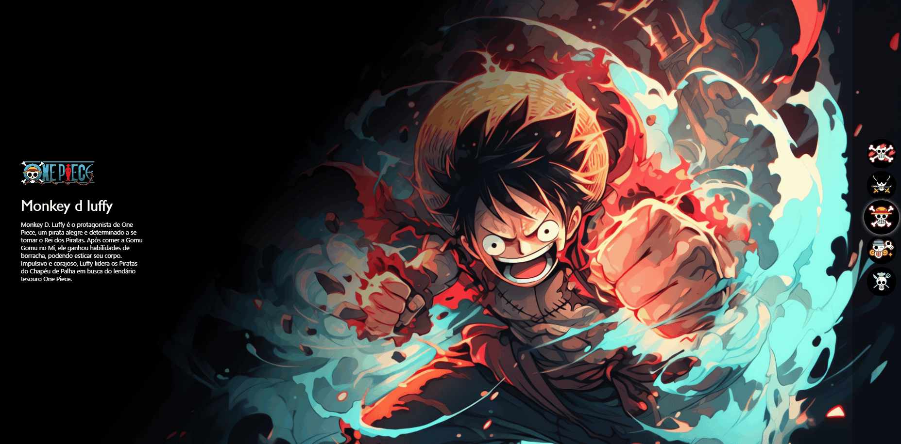

# Projeto


## Descriçao
Este projeto é uma página interativa que exibe personagens do anime/mangá One Piece. A página permite navegar entre os personagens e visualizar informações básicas sobre cada um deles. O objetivo do projeto foi praticar HTML, CSS e JavaScript, além de desenvolver uma interface atrativa para os fãs de One Piece.

## Tecnologias Utilizadas
- HTML: Estrutura da página e organização do conteúdo.

- CSS: Estilos, layout e efeitos visuais.

- JavaScript: Interatividade, alternância entre personagens e manipulação do DOM.

## Como executar o Projeto
1. Clone do Repositorio
``` bash
git clone https://github.com/dorffdaniel/Projeto-One-Piece

```

## Contato
Para mais informações, entre em contato via[linkedin](https://www.linkedin.com/in/daniel-alves-9872392a7/)
